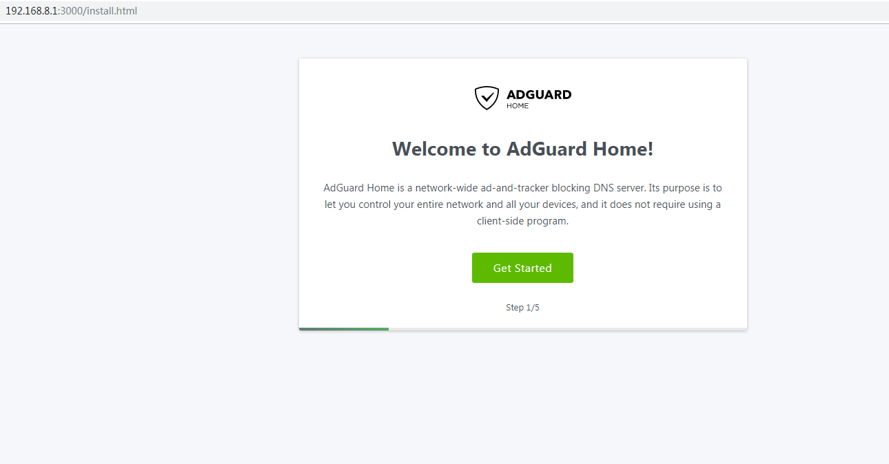
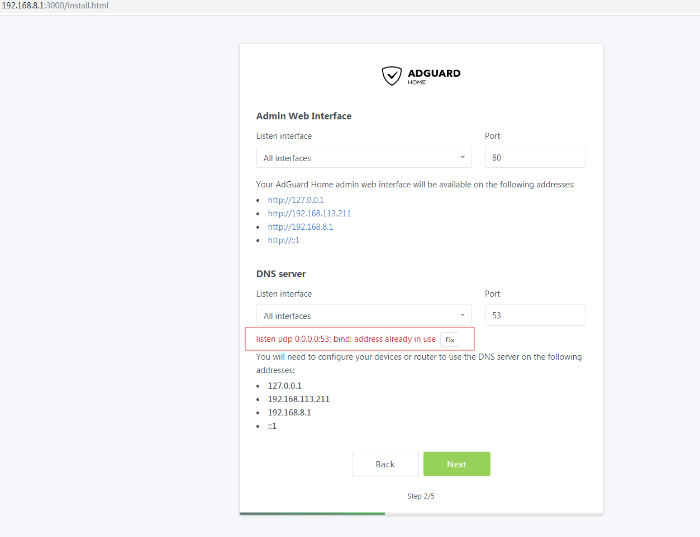
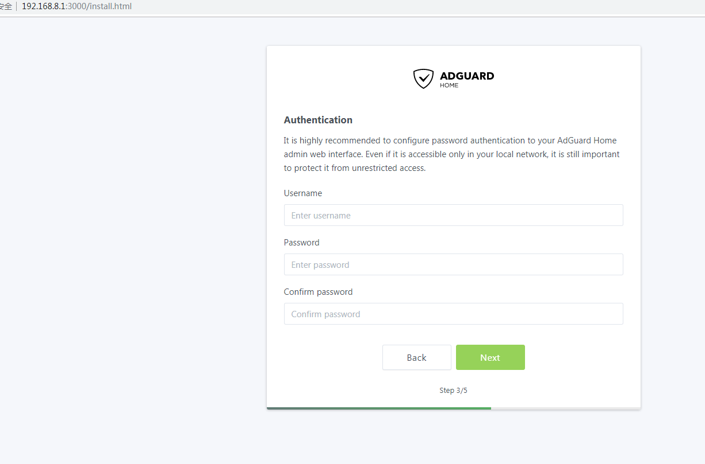
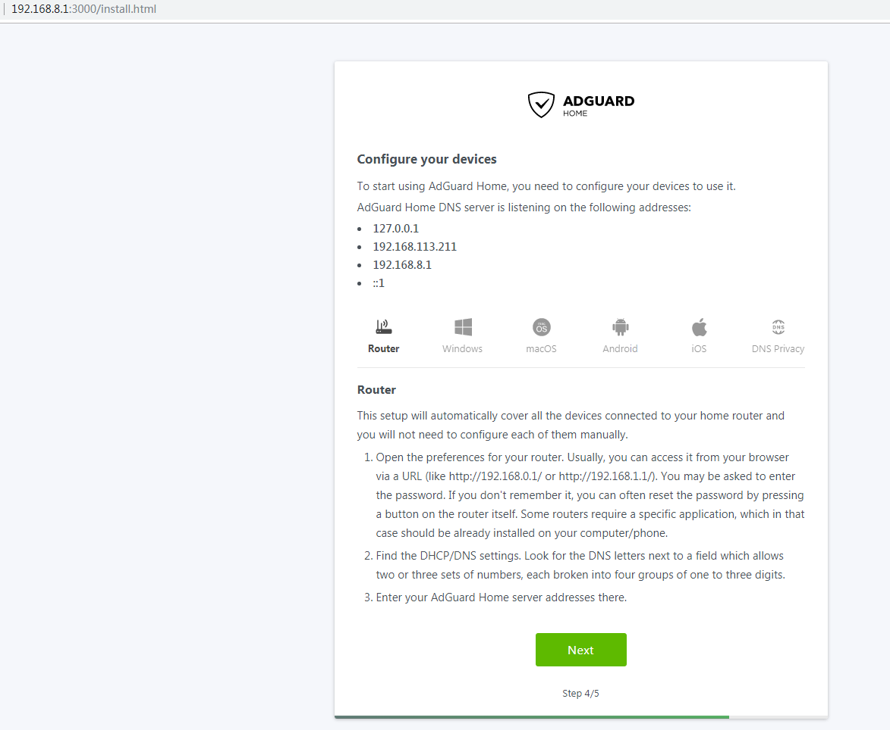
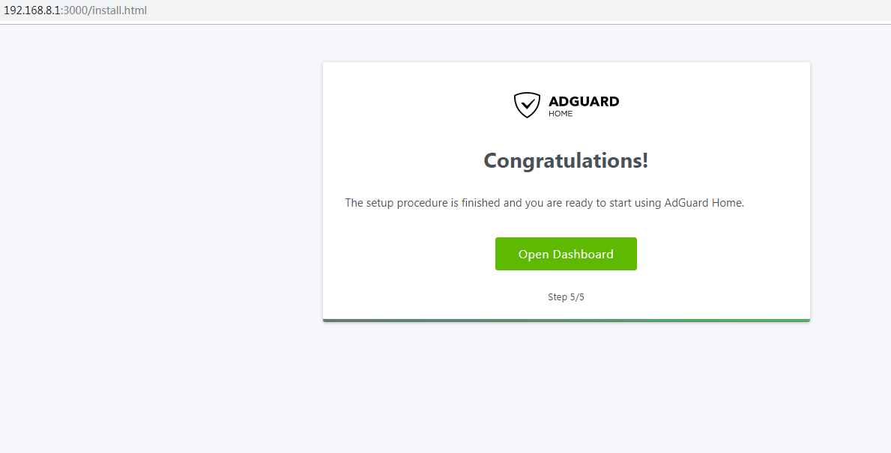
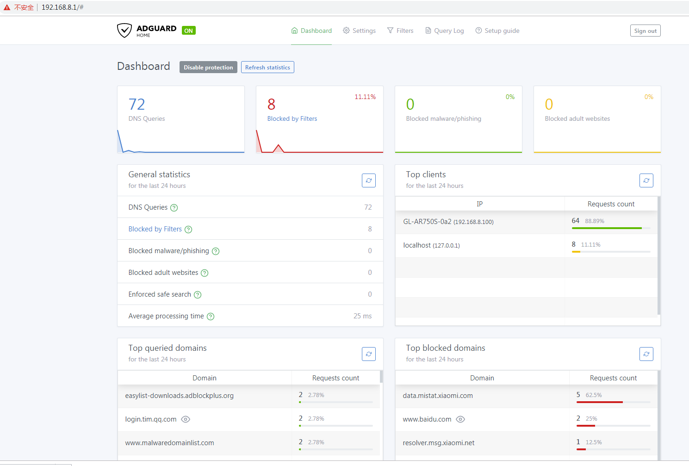

# AdguardHome Installation Guide

**1.** Download and install AdguardHome:

```sh
wget --no-check  https://github.com/AdguardTeam/AdGuardHome/releases/download/v0.99.2/AdGuardHome_linux_arm64.tar.gz
tar -zxvf AdGuardHome_linux_arm64.tar.gz
cd AdGuardHome
chmod a+x AdGuardHome
./AdGuardHome -s install
systemctl start AdGuardHome
systemctl enable AdGuardHome
```

**2.** Open a browser and enter the URL http://192.168.8.1:3000/ to access the AdGuard Home administration page.



**3.** Click "Get Started" and set the web administration page and DNS service port.



**4.** When the red prompt appears, you need to turn off the dnsmasq service that comes with the ubuntu system:

```sh
/etc/init.d/dnsmasq stop
systemctl disable dnsmasq.service
```

**5.** Click on "Fix" and proceed to the next step to set up your username and password.



**6.** Finally click "Next" to complete the configuration.





**7.** Login again to access the dashboard. You can see the number of DNS queries, the website that was filtered and intercepted, the client address for querying DNS requests etc.

**8.** Continue by setting the DNS and DHCP options.



General settings


DNS settings


If your router has DNS problems that cannot be resolved, you will need run the following:

```sh
cd /etc
rm resolv.conf
ln -s ../run/systemd/resolve/resolv.conf resolv.conf
```

If a client connects to the MV1000 and cannot obtain an ip address, you need to configure DHCP in the DHCP settings page:


Filters


Query Log


