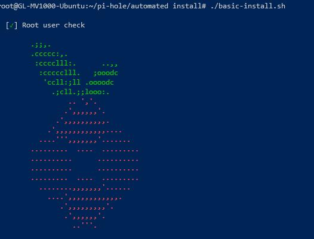
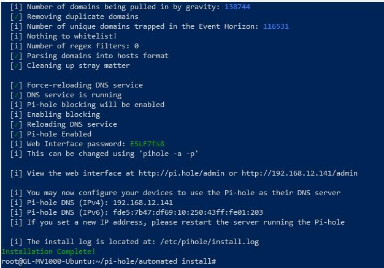
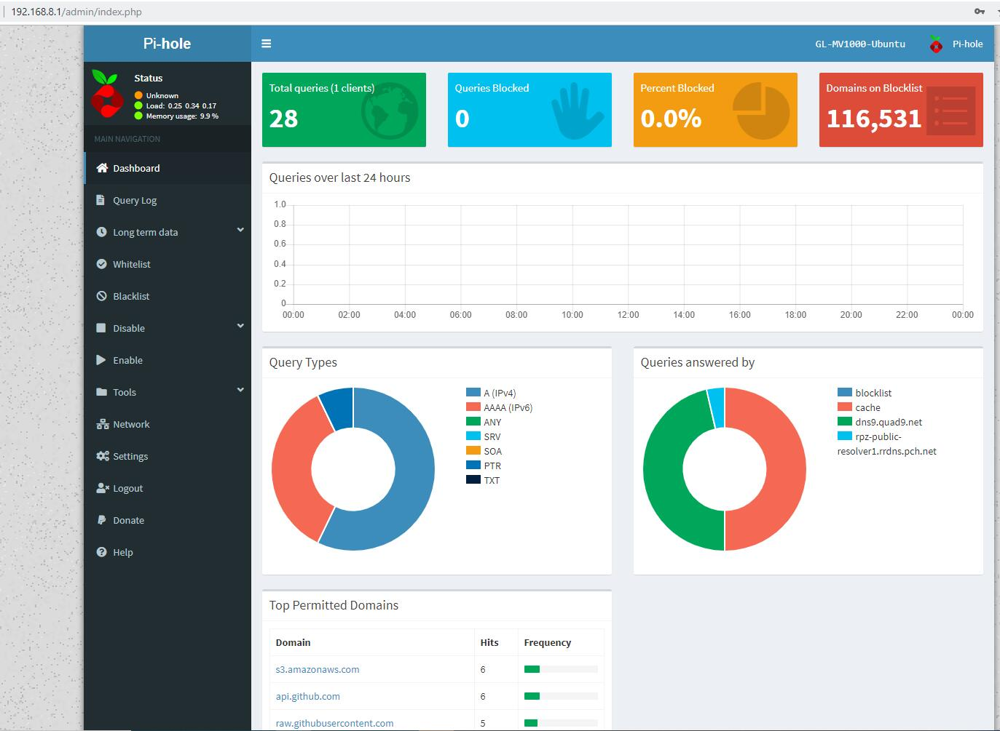

#Installing Pi-hole on MV1000

You have to switch to Ubuntu system on Ubuntu. You need to install necessary tools if you haven't.

```
apt update
apt install git
```

After you install git, you can get the sourcecode of pi-hole

```
git clone --depth 1 https://github.com/pi-hole/pi-hole.git pi-hole
```

Then run installation script:
```
cd pi-hole/automated install
sudo bash basic-install.sh 
```


Follow the prompts to select the proper option.



After installation, you will be able to access the Web Admin Panel of Pi-Hole.

http://192.168.8.1/admin

Then you need to go through a general Pi-Hole setup.


