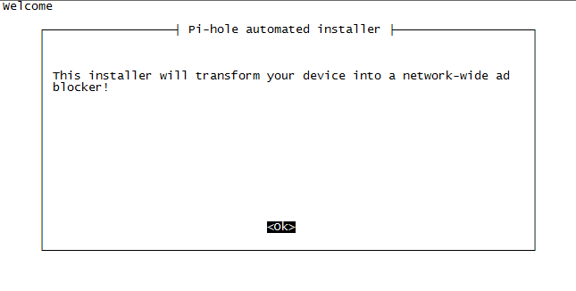
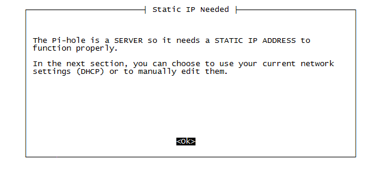
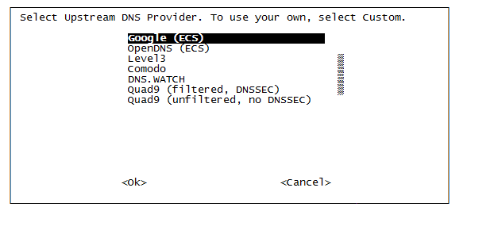
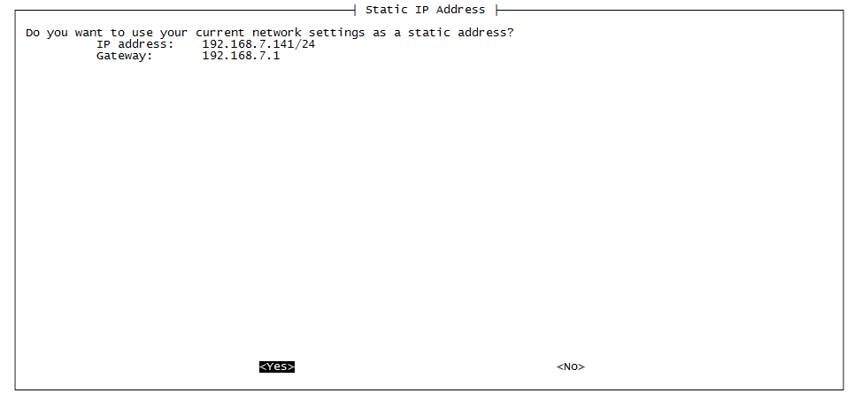
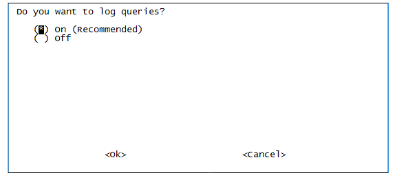
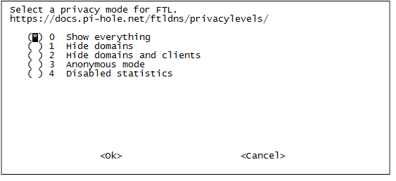
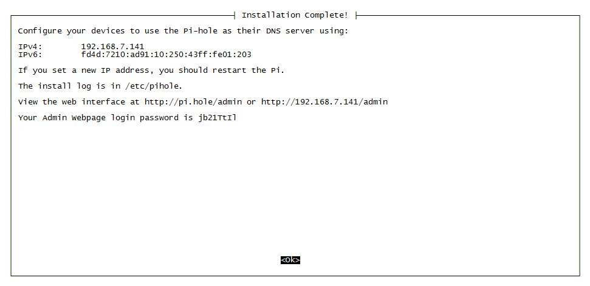
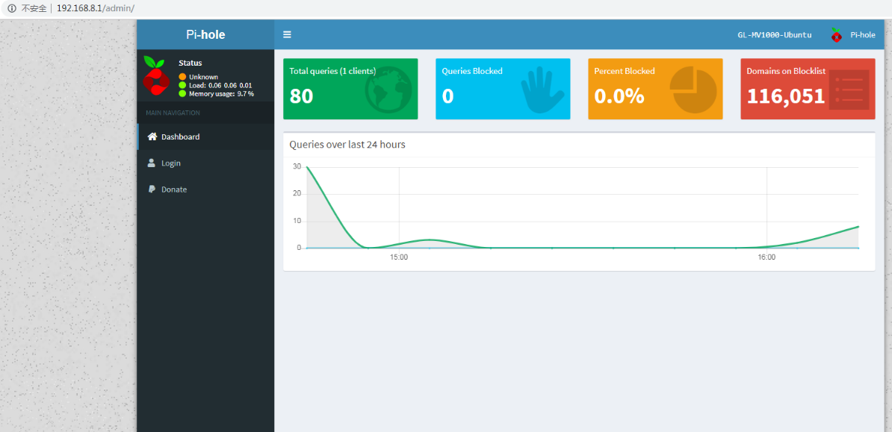
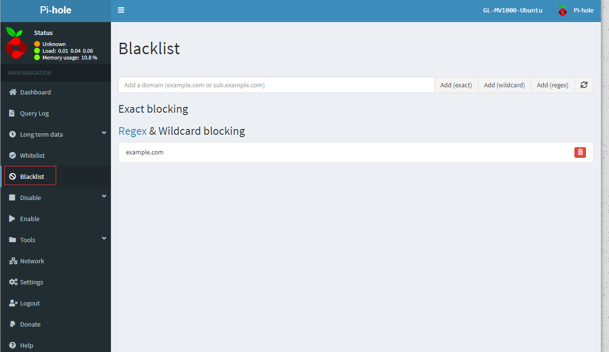

# Pi-hole Installation Guide

The Pi-hole[®](https://pi-hole.net/trademark-rules-and-brand-guidelines/) is a [DNS sinkhole](https://en.wikipedia.org/wiki/DNS_Sinkhole) that protects your devices from unwanted content, without installing any client-side software.

**1.** Install dependencies:

```sh
apt update && apt upgrade -y
apt install -y git
```

**2.** Disable the **dnsmasq** DNS server to solve conflicts with pi-hole installation:

```sh
cp /etc/dnsmasq.conf /etc/dnsmasq.conf.bak
echo "port=0" >>/etc/dnsmasq.conf
systemctl restart dnsmasq
```

**3.** Download Pi-hole source and run the installer:

```sh
git clone --depth 1 https://github.com/pi-hole/pi-hole.git pi-hole
cd pi-hole/automated\ install/
./basic-install.sh
```

**4.** Complete the installation with the following configuration:



















**5.** 🔒 Change the default Pi-hole password:

```sh
pihole -a -p
```

**5.** In step 2 we disabled **dnsmasq**, now we need to enable it again. By default, MV1000 is set as a router for two LAN ports and one WAN port. **dnsmasq** is both a DNS server and a DHCP server, we need to start the DHCP server for LAN clients. Here's a dirty hack for enable the DHCP server of **dnsmasq** without affecting the origial **dnsmasq.service**. Copy and paste the following script into your SSH session/window and press enter to run it:

```sh
cat <<'EOF' > /root/dnsmasq-dhcp-server.conf
interface=br-lan
bind-interfaces
dhcp-range=192.168.8.5,192.168.8.250,255.255.255.0,24h
dhcp-option=option:router,192.168.8.1
port=0
dhcp-option=6,$(cat /etc/dhcpcd.conf  | grep ip_address | cut -f2 -d"=" | cut -f1 -d"/")
EOF
```
In the previous steps, we selected WAN as the working interface for the DNS server. This is why we set "dhcp-option 6" so LAN clients can use Pi-hole as the DNS server.

**6.** Start **dnsmasq** in rc.local; copy, paste and run as before:

```sh
sed -i 's/^exit 0//' /etc/rc.local

cat <<'EOF' >> /etc/rc.local
while true; do
	ip link show br-lan && dnsmasq -C /root/dnsmasq-dhcp-server.conf && break
	sleep 2
done &
exit 0
EOF
```

**7.** Login to the Pi-hole interface either via http://192.168.8.1/admin or http://192.168.7.141/admin (192.168.8.1 is the router LAN IP, 192.168.7.141 is the router WAN port IP) in your browser.




On the following page you can view the network information, and you can configure the block lists, DNS, and more.




For command line examples, here is a list: [https://discourse.pi-hole.net/t/the-pihole-command-with-examples/738](https://discourse.pi-hole.net/t/the-pihole-command-with-examples/738)

For more information, visit the official documentation here: [https://docs.pi-hole.net/main/projects/](https://docs.pi-hole.net/main/projects/)
