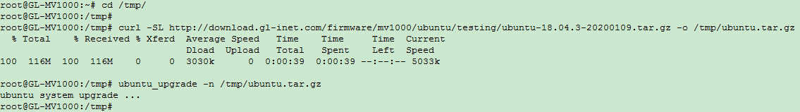

### Appliations of Ubuntu on MV1000 Brume

You need to install Ubuntu as to the guide in this document first before you can use the following applications. 

[Using **Home Assistant** on MV1000 Brume](https://github.com/gl-inet/mv1000-ubuntu-image/blob/master/HA%20Installation%20Guide.md)

[Using **Pi Hole** on MV1000 Brume](https://github.com/gl-inet/mv1000-ubuntu-image/blob/master/pi-hole/MV1000%20install%20Pi-hole%20Guide.md)

[Using **Adguide** on MV1000 Brume](https://github.com/gl-inet/mv1000-ubuntu-image/blob/master/adguard/MV1000%20Install%20AdGuardHome%20Guide.md)

# Before Install prebuilt Ubuntu on MV1000

`caution` **Installing prebuilt Ubuntu will erase eMMC's third partition, i.e. /data under openwrt mount point. So backup your data before install ubuntu.**

You need to check and update uboot version before installing ubuntu

Copy and paste the following script to run in openwrt shell:
```
uboot_need_update=0; \
[ -n "$(strings /dev/mtd0 | grep "U-Boot 2" | grep dirty)" ] && uboot_need_update=1; \
[ -z "$(strings /dev/mtd0 | grep "U-Boot 2")" ] &&  uboot_need_update=1; \
[ $uboot_need_update = 1 ] && \
cd /tmp && \
curl -SL https://github.com/gl-inet/mv1000-ubuntu-image/raw/master/uboot-gl-mv1000-20190901-md5-183eade39f35da8f6fc76c713754af85.bin -o /tmp/uboot.bin && \
[ "$(md5sum /tmp/uboot.bin 2>/dev/null | cut -f1 -d" ")" = "183eade39f35da8f6fc76c713754af85" ] && \
echo "updating uboot..." && \
mtd erase /dev/mtd0 && \
mtd write /tmp/uboot.bin /dev/mtd0 && \
mtd erase /dev/mtd1 && \
reboot; \
[ $uboot_need_update = 0 ] && echo && echo && echo "No need to update uboot" && echo && echo
```

When uboot updated, the system will reboot. Or when it puts "No need to update uboot".
You can go to the next step.

# Install prebuilt Ubuntu on MV1000

Currently Ubuntu installation is only supported by openwrt shell. You cannot install using openwrt webUI or uboot webUI.


You can download the ubuntu image using your browser. Then upload to the router (openwrt) /tmp folder using scp, or winscp.

You can also ssh to the router's openwrt system and download directly.

In mv1000 openwrt shell:
```bash
cd /tmp
curl -SL  https://github.com/gl-inet/mv1000-ubuntu-image/raw/master/ubuntu-18.04.3-20191026.tar.gz -o /tmp/ubuntu-18.04.3-20191026.tar.gz
ubuntu_upgrade -n /tmp/ubuntu-18.04.3-20191026.tar.gz
```



After installation, you must switch OS between Ubuntu and openwrt manually.

Openwrt switch to Ubuntu, in mv1000 openwrt shell:
```
switch_system ubuntu
```

Ubuntu switch to openwrt, in mv1000 Ubuntu shell:
```
switch_system openwrt
```


# Create image based on prebuilt Ubuntu
## Example 1. Add pacakge and config
- Install preuilt image and login into Ubuntu
- Make changes: apt-get install and other configuration
- Switch to openwrt in mv1000 Ubuntu shell:
```
switch_system openwrt
```
- By default the ubuntu filesystem is mounted on /data,
  Archive the whole filesystem of ubuntu, in mv1000 opnewrt shell:
```
cd /data
tar czf /tmp/ubuntu.tar.gz *
```
Then download the newly made ubuntu.tar.gz image.

## Example 2. Install cross compiled kernel image, dtb, and kernel module

Get prebuilt Ubuntu and decompress:
```
mkdir -p ~/mv1000-ubuntu/
cd ~/mv1000-ubuntu/
git clone https://github.com/gl-inet/mv1000-ubuntu-image.git ubuntu-rootfs
cd ubuntu-rootfs
mkdir rootfs
sudo tar xf ubuntu-18.04.3-20191026.tar.gz -C rootfs
```
After build kernel from source, refering to
https://github.com/gl-inet/mv1000-ubuntu-kernel/blob/master/README.md

**clean old modules by rm -fr with caution**
```
sudo rm -fr ~/mv1000-ubuntu/ubuntu-rootfs/rootfs/lib/modules/*
```

Install kernel image and dtb:
```
cd ~/mv1000-ubuntu/ubuntu-kernel
sudo cp arch/arm64/boot/Image ~/mv1000-ubuntu/ubuntu-rootfs/rootfs/boot/
sudo cp arch/arm64/boot/dts/marvell/armada-gl-mv1000-ubuntu.dtb ~/mv1000-ubuntu/ubuntu-rootfs/rootfs/boot/
sudo make ARCH=arm64 modules_install INSTALL_MOD_PATH=~/mv1000-ubuntu/ubuntu-rootfs/rootfs
```

Optionally you can archive the .config and generated header etc for local compiling kernel modules.
```
cd ~/mv1000-ubuntu/ubuntu-kernel
tar cf compile_generated.tar include/config/ include/generated/ arch/arm64/include/generated/ Module.symvers  .config
sudo cp compile_generated.tar ~/mv1000-ubuntu/ubuntu-rootfs/rootfs/usr/src
```

Now archive the new image:
```
cd ~/mv1000-ubuntu/ubuntu-rootfs/rootfs
sudo tar -czf ../ubuntu.tar.gz *
```
Then download the newly made ubuntu.tar.gz image.

# Kernel module package installation example - wireguard

## Method 1 - local compile
All following command is in Ubuntu shell.

Optional change package source list.
```
cp /etc/apt/sources.list /etc/apt/sources.list.backup
sed -i 's|http://ports.ubuntu.com/ubuntu-ports/|http://mirrors.aliyun.com/ubuntu-ports/|g' /etc/apt/sources.list
```

```
apt-get update
apt-get install software-properties-common
add-apt-repository ppa:wireguard/wireguard
apt-get update
apt-get install wireguard
```
Wireguard kernel module will fail to build for non-standard ubuntu kernel, workaround is to build kernel module from source.

Prepare build environment:
```
apt-get install libmnl-dev libelf-dev build-essential pkg-config bc git
```
Get kernel source tree:
```
cd /usr/src
git clone https://github.com/gl-inet/mv1000-ubuntu-kernel.git ubuntu-kernel
```
Get your running kernel's .config and generated header etc if you build your own kernel.
```
tar xf /usr/src/compile_generated.tar -C /usr/src/ubuntu-kernel
cd /usr/src/ubuntu-kernel
make oldconfig
make modules_prepare
make -C /usr/src/ubuntu-kernel M=/usr/src/wireguard-0.0.20190913 clean
make -C /usr/src/ubuntu-kernel M=/usr/src/wireguard-0.0.20190913
make -C /usr/src/ubuntu-kernel M=/usr/src/wireguard-0.0.20190913 modules_install
depmod
```

## Method 2 - cross compile
*When compiling kernel module, gcc version should be consistent with version to compile kernel image.
Current available ubuntu kernel image is compile by gcc5, so local compiling will not work for ubuntu 18.04 with default gcc7*

Original reference:

http://wiki.espressobin.net/tiki-index.php?page=Getting+Started+Tutorials

http://wiki.espressobin.net/tiki-index.php?page=Software+HowTo
