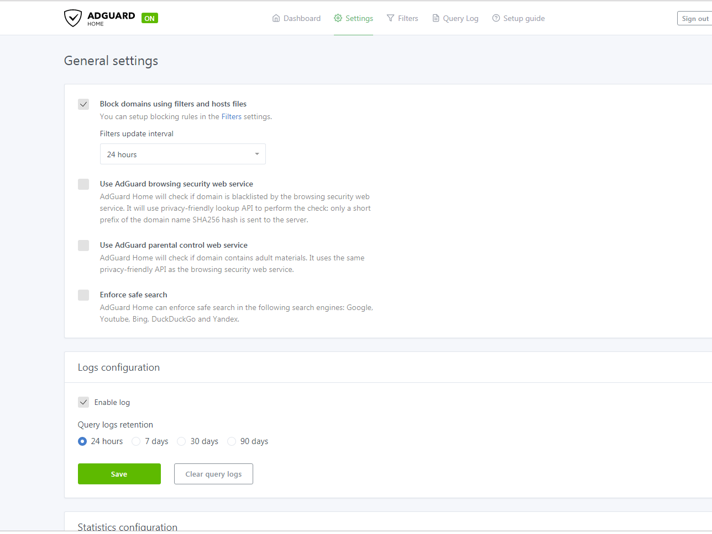
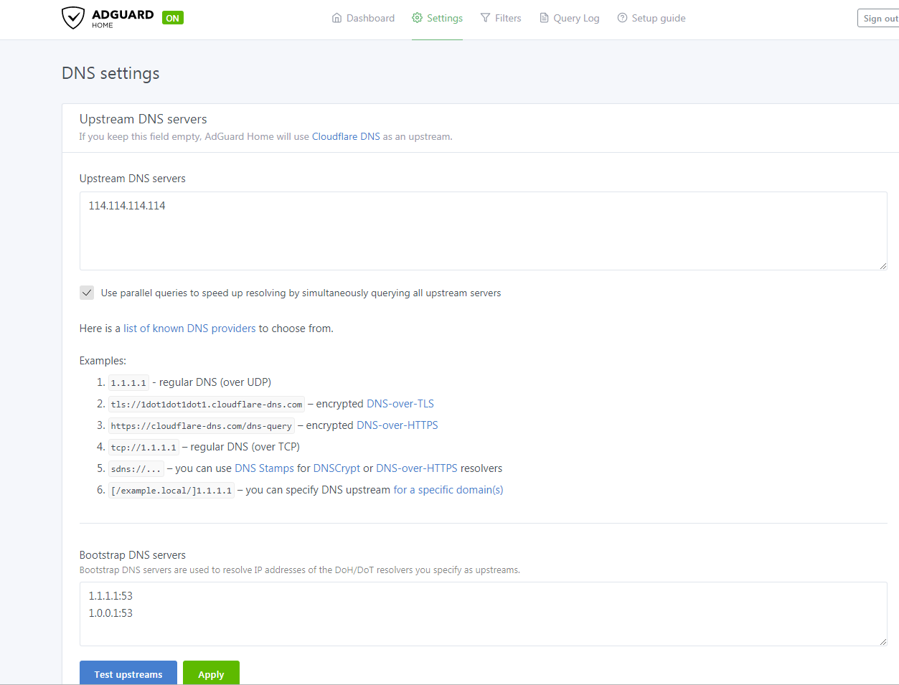
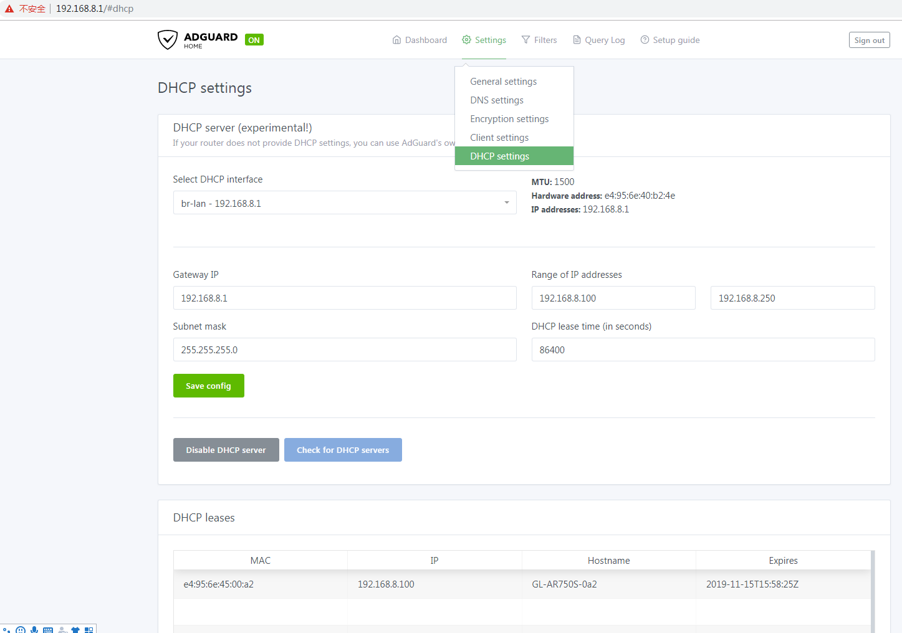
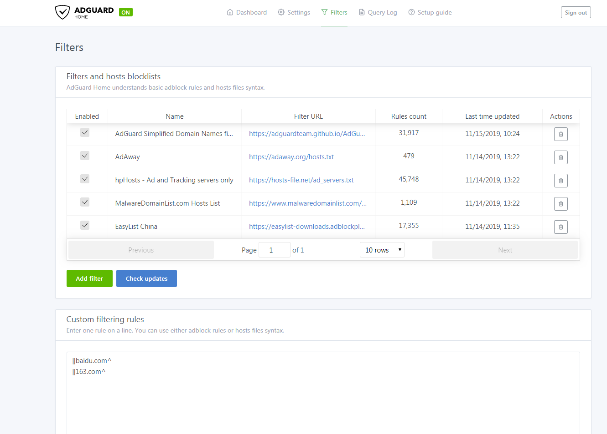
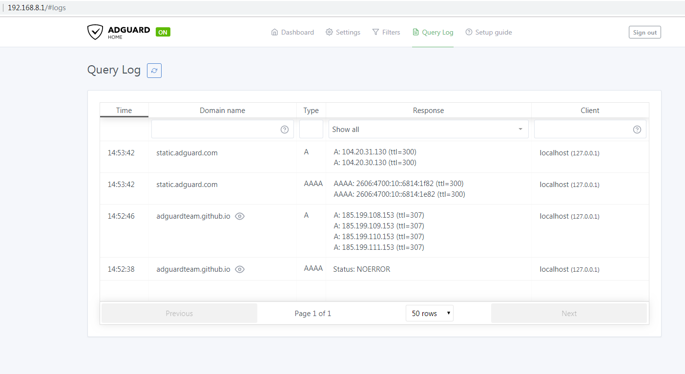

# Install Dependent Program

```
sudo apt update
sudo apt install nano bind9-host
```


# Download and Install AdGuardHome

```
wget --no-check  https://github.com/AdguardTeam/AdGuardHome/releases/download/v0.99.2/AdGuardHome_linux_arm64.tar.gz
tar -zxvf AdGuardHome_linux_arm64.tar.gz
cd AdGuardHome
chmod a+x AdGuardHome
./AdGuardHome -s install   
systemctl start AdGuardHome  
systemctl enable AdGuardHome
```

# Configuration AdGuardHome

Open a browser and enter the URL http://192.168.8.1:3000/ to access the AdGuard Home administration page.


Click "Get Started" and set the web administration page and DNS service port.


When the red prompt appears, you need to turn off the dnsmasq service that comes with the ubuntu system.

```
/etc/init.d/dnsmasq stop
systemctl disable dnsmasq.service
```

Then click on "Fix" and proceed to the next step to set up your username and password.


Finally click "Next" to complete the configuration.


Then log in again to see the dashboard, you can see the number of DNS queries, the website that was filtered and intercepted, the client address for querying DNS requests, and so on.


General settings




DNS settings



If your router has DNS problems that cannot be resolved, you will need the following settings.

```
cd /etc
rm resolv.conf
ln -s ../run/systemd/resolve/resolv.conf resolv.conf
```

If the client connects to the MV1000 and cannot obtain an ip address, you need to configure DHCP on the DHCP settings page.




Filters




Query Log




