# MV1000 install Pi-hole Guide

## Pi-hole

The Pi-hole[®](https://pi-hole.net/trademark-rules-and-brand-guidelines/) is a [DNS sinkhole](https://en.wikipedia.org/wiki/DNS_Sinkhole) that protects your devices from unwanted content, without installing any client-side software.

## MV1000 install Ubuntu System and Environment Preparation

1. You can refer the documentation
   <https://docs.gl-inet.com/en/3/app/ssh/>,
   connect to the router with WinSCP, copy the ubuntu system file ubuntu.tar.gz to
   the router tmp directory.

2. You need the ssh router to upgrade to the ubuntu system with the following command:

    ubuntu_upgrade -n /tmp/ubuntu.tar.gz 

    switch_system ubuntu

3. Install software soft package

   sudo apt-get install git

## Download Pi-hole Source and Installation Script

1. Download pi-hole source and install

​		git clone -–depth 1 <https://github.com/pi-hole/pi-hole.git> pi-hole

​    	cd pi-hole/automated install/

   	 sudo bash basic-install.sh

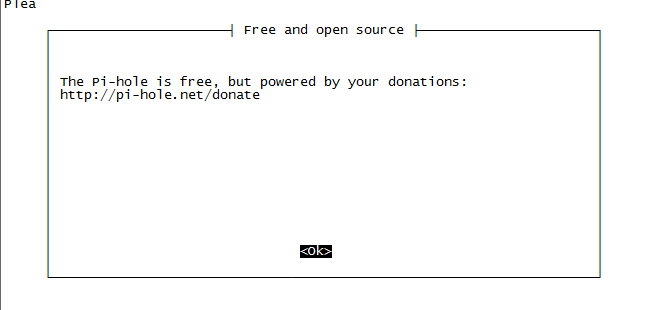

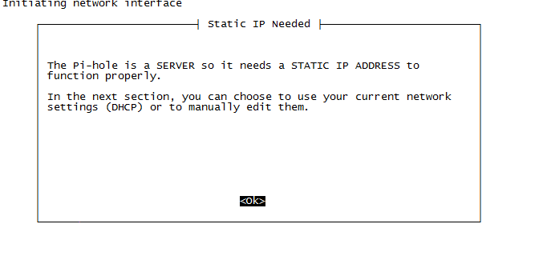

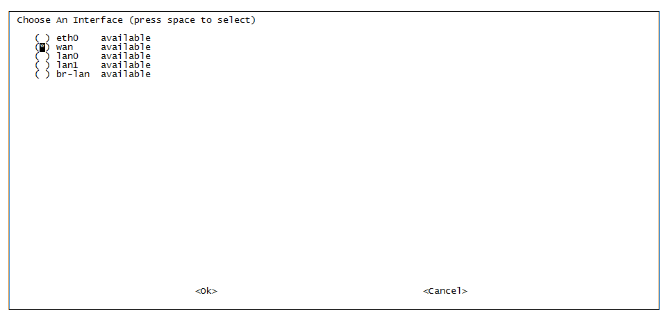

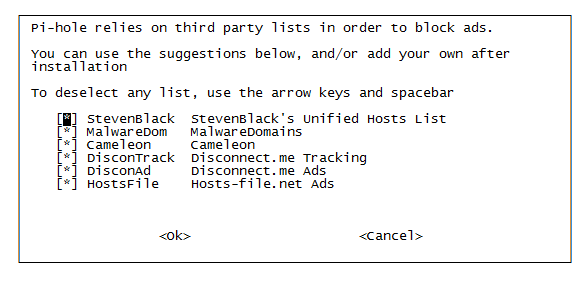

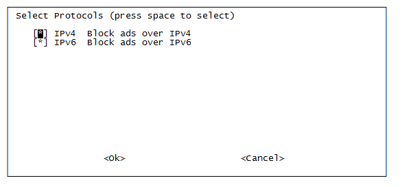

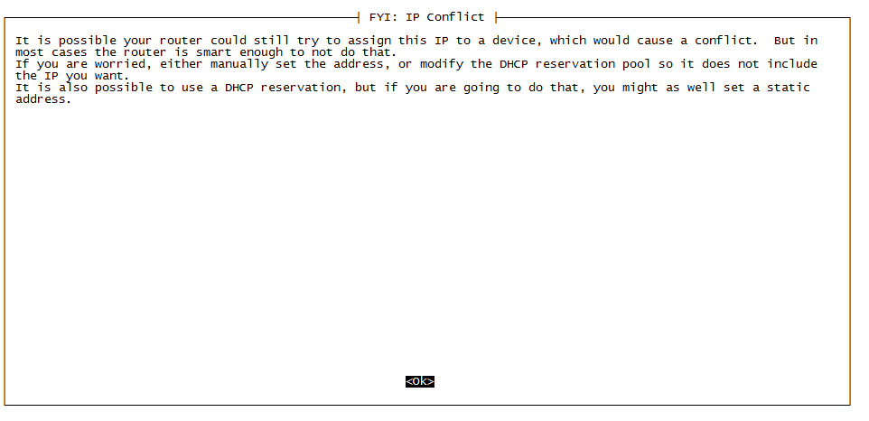

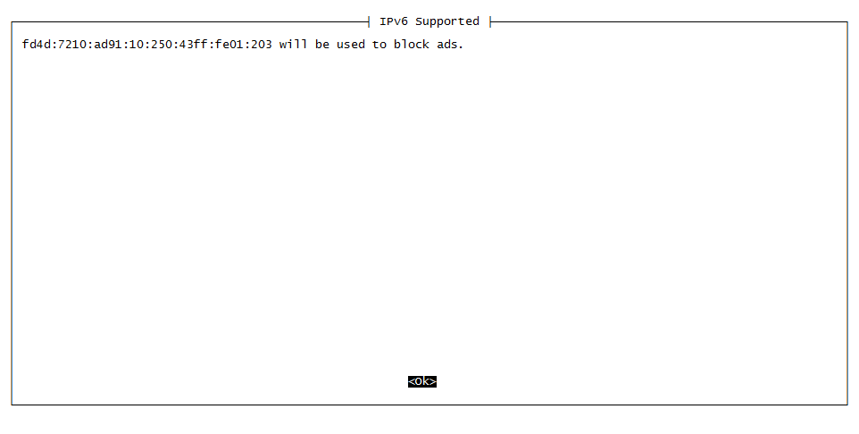

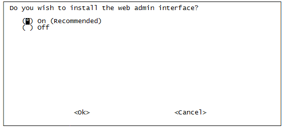

## Login Web Page

After the installation is
complete, enter http://192.168.8.1/admin or <http://192.168.7.141/admin(192.168.8.1 is the router LAN IP, 192.168.7.141 is the router WAN port IP) in the browser to open the login interface.

SSH to the router to modify the login password with the command

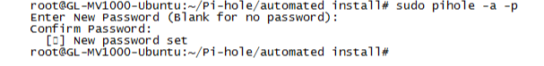

Then you can log in to the pi-hole management page.

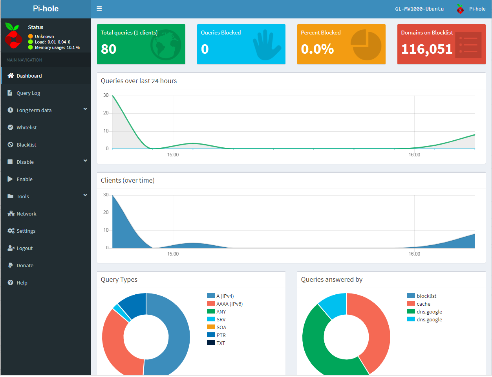

On the page you can view the network information, you can
configure the black and white list and dns, etc.

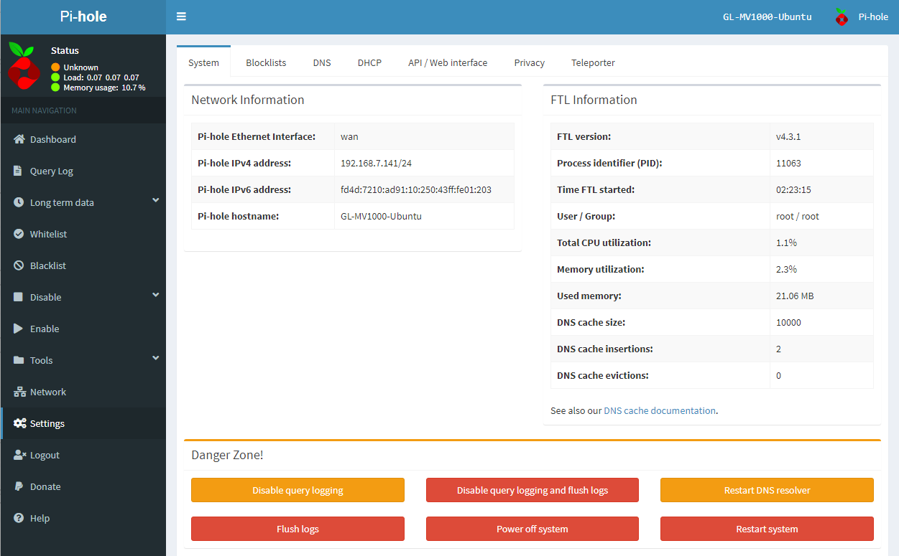

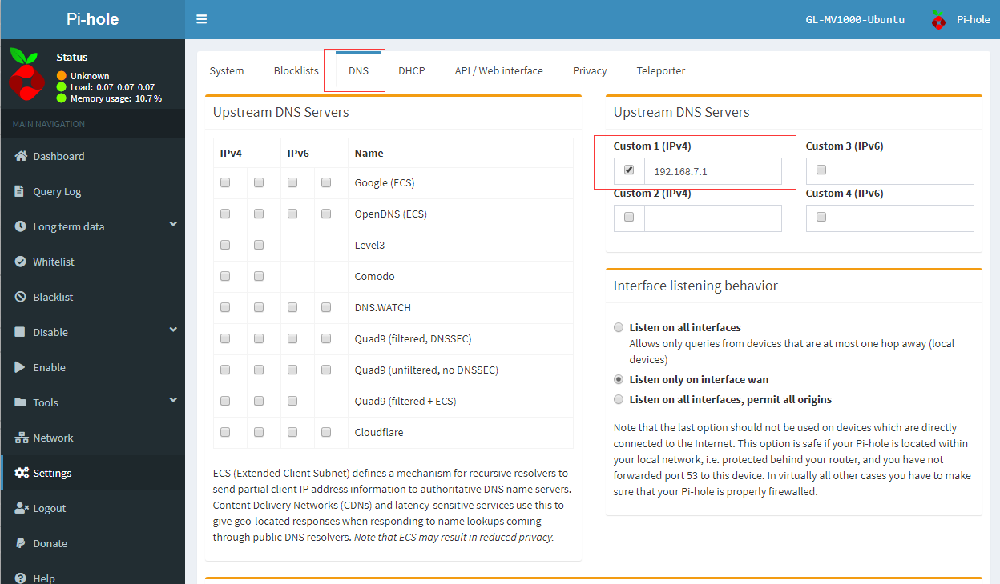

The background pihole configuration command can view the official documentation. <https://discourse.pi-hole.net/t/the-pihole-command-with-examples/738>

More configuration information to view <https://docs.pi-hole.net/main/projects/>

